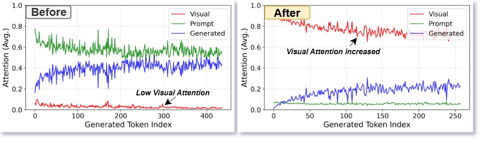
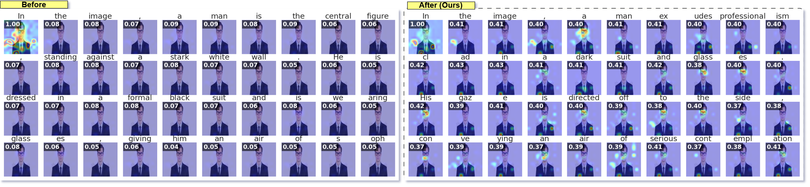
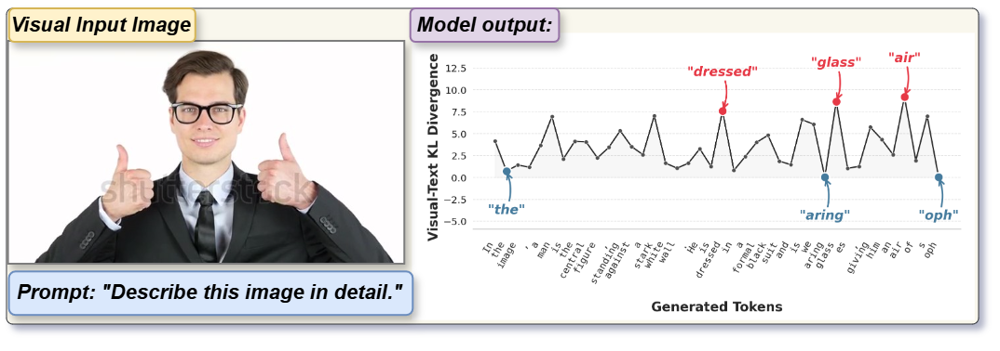
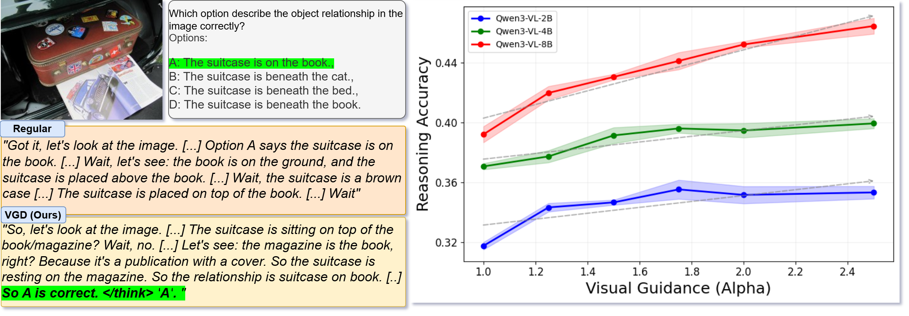
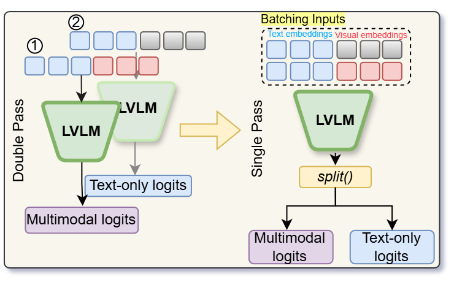

# Visual Guidance Decoding for Attention Sink in Large Visual Language Models

[](https://anonymous.4open.science/r/VGD-03D4)

## 📌 Overview
Large Vision-Language Models (LVLMs) frequently suffer from **Visual Attention Sink**, a critical degradation where the model's attention progressively detaches from visual tokens during text generation. This causes the model to fall back on textual language priors, resulting in severe object hallucinations and ungrounded generation.

**Visual Guidance Decoding (VGD)** is a plug-and-play, training-free decoding strategy that actively counteracts this attention decay. By dynamically amplifying the visual signal during autoregressive generation, VGD forces the model to re-attend to visual features, significantly reducing hallucinations and breaking repetitive text loops.

---

## 🧐 The Problem: Visual Attention Sink

During autoregressive decoding, accumulating textual context dominates the model's attention budget. As the sequence lengthens, the normalized visual attention ratio rapidly decreases. 

<p align="center">
  
</p>

**Figure 1: The Fading Memory Effect.** *Top (Baseline):* The model assigns consistently low attention to visual tokens, relying predominantly on the textual prompt and previously generated tokens. *Bottom (VGD):* Our method substantially increases visual attention throughout generation, guiding the model from textual reliance back towards vision-driven generation.

<p align="center">
  
</p>

**Figure 2: Spatial Defocusing.** As generation progresses, baseline decoding (left) exhibits a consistent weakening as attention migrates from visual to textual tokens, becoming diffuse. VGD (right) sustains a higher visual attention ratio ($r_t$) throughout generation.

---

## 💡 Our Solution: Visual Guidance Decoding (VGD)

VGD isolates the distinct information provided by the visual encoder by contrasting the standard multimodal distribution against a "blind" text-only baseline. 

<p align="center">
  
</p>

**Figure 3: Visual Evidence Reliance.** The divergence between multimodal and text-only predictions dynamically spikes for visually descriptive terms (e.g., *dressed*, *glass*) and drops near zero for syntactic function words. VGD capitalizes on this by amplifying the visual signal exactly when it matters.

For each token step $t$, VGD adjusts the generation logits:

$$h^{\text{VGD}}_\theta(y_t| x, v, y_{<t}) = h_\theta(y_t| x, y_{<t}) + \alpha \cdot (h_\theta(y_t| x, v, y_{<t}) - h_\theta(y_t| x, y_{<t}))$$

When the distributions diverge (indicating visual reliance), VGD amplifies the visual cue by the scale $\alpha$. When they are similar, VGD safely defers to standard decoding.

---

## 🎯 Qualitative Results: Breaking Hallucination Loops

Regular decoding often suffers from repetitive and overly verbose reasoning paths driven by ungrounded language priors. 

<p align="center">
  
</p>

**Figure 4: Grounded Reasoning.** *Left:* Regular decoding falls into a repetitive hallucination loop. VGD successfully grounds its reasoning in the image to arrive at the correct answer. *Right:* Reasoning accuracy consistently scales as the visual guidance parameter ($\alpha$) increases.

---

## ⚡ Batched Acceleration Strategy

A significant limitation of previous contrastive decoding methods (like VCD) is the computational cost of requiring two sequential forward passes per generation step. 

<p align="center">
  
</p>

**Figure 5: Efficient Forward Batching.** We pack the conditional and unconditional inputs along the batch dimension, computing both distributions simultaneously in a single forward pass. This leverages GPU parallelism to execute at speeds much closer to regular decoding.

| Decoding Strategy | Speed (TPS) | Relative Speed | GPU Mem (GB) |
| :--- | :---: | :---: | :---: |
| Regular Decoding | 24.5 | 1.00x | 14.2 |
| VCD (Sequential) | 11.8 | 0.48x | 14.2 |
| **VGD (Batched)** | **18.2** | **0.68x** | 18.5 |

---

## 📊 Quantitative Results

VGD delivers consistent, zero-shot performance improvements across multiple leading LVLM architectures. *(Evaluated using greedy decoding).*

| Model | Method | MMStar (Acc) | MME (Score) | ScienceQA (Acc) | RealWorldQA | Avg. Gain |
| :--- | :--- | :---: | :---: | :---: | :---: | :---: |
| **Qwen2.5-VL-7B** | Regular | 0.613 | 1055.69 | 0.828 | 0.651 | - |
| | **VGD (Ours)** | **0.637** | **1518.07** | **0.844** | **0.686** | **+13.8%** |
| **Qwen3-VL-8B** | Regular | 0.473 | 1723.09 | 0.604 | 0.703 | - |
| | **VGD (Ours)** | **0.522** | **1733.56** | **0.674** | **0.711** | **+5.9%** |
| **InternVL3.5-2B**| Regular | 0.557 | 1471.20 | 0.886 | 0.589 | - |
| | **VGD (Ours)** | **0.587** | **1505.09** | 0.883 | **0.605** | **+2.5%** |
| **LLaVA-Next-7B** | Regular | 0.375 | 1197.03 | 0.651 | 0.513 | - |
| | **VGD (Ours)** | **0.376** | **1335.31** | **0.668** | **0.554** | **+5.6%** |

---

## 🙏 Acknowledgments

This project is built upon the excellent VLMEvalKit framework. We thank the authors and contributors of VLMEvalKit for providing a robust and open-source evaluation suite for Large Vision-Language Models, which greatly facilitated our experimental pipeline.

---

## 💻 Getting Started

### Installation
```bash
git clone [https://github.com/your-username/VGD.git](https://github.com/your-username/VGD.git)
cd VGD
pip install -r requirements.txt
